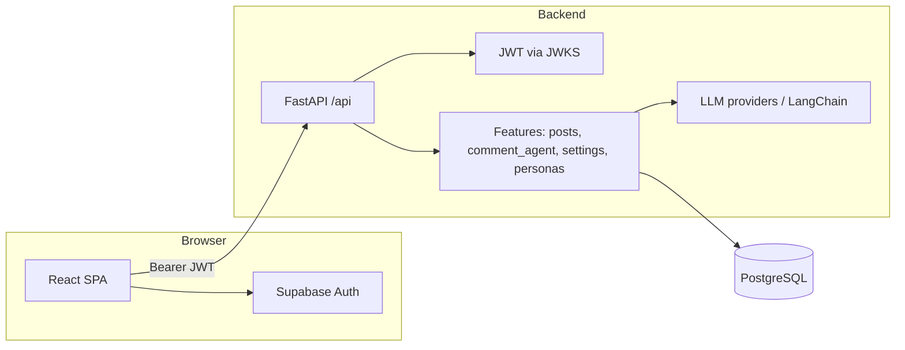

# Architecture Overview

> Last Updated: 2026-03-30

## System Overview

The browser loads the Vite/React SPA, which authenticates with Supabase and calls the Monolog FastAPI backend with the session access token. The backend validates JWTs, scopes data by `user_id` (Supabase `sub`), and persists state in PostgreSQL via SQLAlchemy. LLM-backed comment flows use provider keys stored encrypted per user.

## Architecture Diagram



## Domains

### Posts & comments

- **Responsibility**: CRUD for user posts; threaded comments; HTTP triggers for AI generation.
- **Location**: `backend/app/features/posts/`, `frontend/src/features/posts/`
- **Dependencies**: Auth, DB, user bootstrap, `comment_agent` for generation

### Comment agent (LLM)

- **Responsibility**: LangChain planning + writing for initial post comments and AI replies to user comments; candidate pool rules (custom vs preset).
- **Location**: `backend/app/features/comment_agent/`, `backend/app/shared/comment_langchain/`
- **Dependencies**: Personas service (library + custom), settings/secrets, providers

### Settings & secrets

- **Responsibility**: LLM provider and model selection; encrypted storage of API keys; custom model lists.
- **Location**: `backend/app/features/settings/`, `frontend/src/features/settings/`
- **Dependencies**: Auth, DB, crypto store, provider registry

### Personas

- **Responsibility**: Active persona list per user, library presets, per-user overrides, **user custom personas** (`user_custom_personas`, API ids `c:<uuid>`), feedback order.
- **Location**: `backend/app/features/personas/`, `frontend/src/features/personas/`
- **Dependencies**: Auth, DB, `persona_library`, `user_custom_personas`, persona state tables

### Auth

- **Responsibility**: Resolve `user_id` from Supabase JWT; no separate Monolog user table beyond `profiles` and related rows.
- **Location**: `backend/app/features/auth/jwt.py`, `backend/app/shared/deps.py`
- **Dependencies**: JWKS URL, Supabase token contract

## Package Hierarchy

Dependencies flow from API handlers toward services, then shared models and DB:

```
HTTP routers (api.py)
    → feature services
    → shared models, db, crypto, llm
```

## Data Flow

1. User signs in via Supabase; frontend obtains `access_token`.
2. `apiFetch` (`frontend/src/shared/lib/apiClient.ts`) prefixes `VITE_API_BASE_URL` + `/api` and sends `Authorization: Bearer …`.
3. `get_auth_context` opens a DB session, decodes JWT to `user_id`, runs `ensure_user_rows`, and injects `AuthContext`.
4. Handlers query or mutate rows keyed by `user_id` (and post/persona ids as applicable).

## Key Technical Decisions

| Decision | Rationale | Alternatives |
|----------|-----------|--------------|
| Supabase JWT for API auth | Aligns frontend session with backend user id (`sub` as UUID) | Custom auth server |
| CamelCase in JSON for posts/personas | Matches frontend TypeScript conventions | Snake_case everywhere |
| Encrypted `user_secrets` for API keys | Keys not stored in plain text in DB | Env-only keys (no per-user keys) |

## Related Documentation

- [docs/API.md](docs/API.md) — endpoint reference
- [docs/DATABASE.md](docs/DATABASE.md) — table definitions
- [docs/DESIGN.md](docs/DESIGN.md) — UI design system
