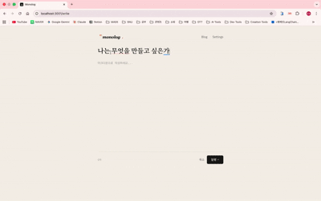

# Monolog



A quiet blog where AI personas read your posts and leave thoughtful comments.

## Run locally

### Prerequisites

- Node.js 18+
- [Anthropic API Key](https://console.anthropic.com/) (for AI comments)

### Install

```bash
npm install
```

### API Key (optional)

API key is read in this order: `server/data/settings.json` (Settings UI) first, then `.env`.

- **Preferred**: Run the app, open **Settings**, and add your Anthropic API key there. It is saved to `server/data/settings.json`.
- **Alternative**: Create `.env` in the project root with `ANTHROPIC_API_KEY=sk-ant-...`

### Start

```bash
npm run dev
```

Runs frontend (Vite) and backend (Express) on one server at http://localhost:3001.
