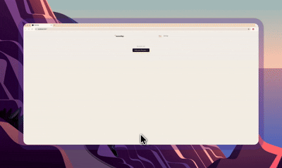
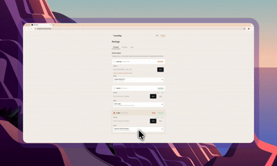

# Monolog

> An AI blog that writes the first comment on your posts.

## The Power of the First Comment

On the internet, the first comment shapes how everyone else reads a post.
But the reality? Most posts never even get one.

If you've ever written a blog, you know the feeling.
The disappointment is one thing, but **without feedback, your writing never improves.** You write alone, read alone, and it ends alone.

Monolog solves this. When you publish a post, **AI readers with different perspectives** read your writing and leave comments.
They become the first readers of your work.

<p align="center">
  
</p>

## How It Works

1. **Write** — Compose your post in a Markdown editor
2. **AI reads** — Multiple personas read your post from their unique perspectives
3. **Comments arrive** — From warm encouragement to sharp critique, diverse feedback appears
4. **Conversation continues** — Reply to comments and AI responds back, creating a real dialogue

<p align="center">
  
</p>

## Your First Readers

The AI readers who read your writing first:

| Persona | Role | What they comment on |
|---------|------|---------------------|
| **Mina** | First Reader | What resonated emotionally, warm first impressions |
| **Grace** | Writing Companion | Where sentences shine, where flow breaks |
| **James** | Practical Mentor | Reality-checking ideas with practical wisdom |
| **Sam** | Logic Critic | Logical gaps, hidden premises, weak arguments |
| **Dylan** | Contrarian | Devil's advocate who strengthens ideas by flipping them |

Beyond these, you can add readers from a **library of 20+ personas** — a VC partner who gives pitch feedback, a poet who reads the emotion in your words, and more. You can also create your own.

## When To Use

- **Writing you're not ready to share widely** — Unfinished thoughts, controversial topics
- **When you need beta-stage feedback** — Validate from multiple angles before publishing
- **When you need someone to respond** — Develop your writing through dialogue, even when writing alone

## Privacy & Data

Monolog is built for **signed-in users** with data stored in **your Supabase project** (posts, comments, persona configuration). The hosted API (**FastAPI on Railway**) encrypts LLM API keys you enter in Settings before persisting them. You can also set default provider keys on the server via environment variables.

- **BYOK** — Bring your own API keys for Anthropic, OpenAI, or Google; they are never sent back to the browser after saving (only masked labels are shown).
- **Auth** — Sign-in uses Supabase Auth with **Google OAuth** (configure the Google provider in the Supabase dashboard).

---

## Local development

### Prerequisites

- **Node.js 18+**
- **Python 3.11+**
- **Supabase project** with a Postgres schema that matches the backend ([backend/app/models.py](backend/app/models.py)) — create tables however you prefer (SQL Editor, CLI, or your own migration repo)
- Optional: LLM API keys (or configure keys on the backend env)

### 1. Database & Auth

Initialize tables and policies in Supabase so they match the SQLAlchemy models in `backend/app/` (e.g. `profiles`, `user_settings`, `posts`, `comments`, `persona_library`, `user_custom_personas`, auth trigger for new users). Enable the **Google** auth provider and set redirect URLs for `http://localhost:5173` (and production origins).

### 2. Backend (`backend/`)

```bash
cd backend
python -m venv .venv && source .venv/bin/activate  # Windows: .venv\Scripts\activate
pip install -r requirements.txt
cp .env.example .env
# Edit .env: DATABASE_URL, SUPABASE_JWKS_URL, FERNET_KEY, CORS_ORIGINS
uvicorn app.main:app --reload --host 0.0.0.0 --port 8000
```

`SUPABASE_JWKS_URL` should be `https://<project-ref>.supabase.co/auth/v1/.well-known/jwks.json`.

Generate a Fernet key:

```bash
python -c "from cryptography.fernet import Fernet; print(Fernet.generate_key().decode())"
```

### 3. Frontend (`frontend/`)

```bash
cd frontend
cp .env.example .env.local
# Set VITE_SUPABASE_URL, VITE_SUPABASE_ANON_KEY; leave VITE_API_BASE_URL empty for dev
npm install
npm run dev
```

Open http://localhost:5173 — Vite proxies `/api` to the backend on port 8000.

<p align="center">
  
</p>

---

## Deployment

See [DEPLOYMENT.md](DEPLOYMENT.md) for Vercel (frontend), Railway (API), and Supabase configuration.

---

## Project structure

```
monolog/
├── frontend/           # Vite + React (deploy to Vercel)
├── backend/            # FastAPI (deploy to Railway)
└── DEPLOYMENT.md
```

## Tech stack

- [React 19](https://react.dev/) + [Vite](https://vitejs.dev/)
- [FastAPI](https://fastapi.tiangolo.com/)
- [Supabase](https://supabase.com/) (Postgres + Auth)
- [Tailwind CSS 4](https://tailwindcss.com/)
- [TypeScript](https://www.typescriptlang.org/)

<details>
<summary>API reference (same paths as before; all require <code>Authorization: Bearer &lt;Supabase access token&gt;</code> except health)</summary>

### Health

| Method | Endpoint | Description |
|--------|----------|-------------|
| GET | `/api/health` | Health check |

### Posts & comments

| Method | Endpoint | Description |
|--------|----------|-------------|
| GET | `/api/posts` | List posts for the current user |
| GET | `/api/posts/:id` | Get one post |
| POST | `/api/posts` | Create a post |
| PUT | `/api/posts/:id` | Update a post |
| DELETE | `/api/posts/:id` | Delete a post |
| POST | `/api/posts/:id/comments` | Add a comment |
| POST | `/api/posts/:id/comments/generate` | Generate AI comments |

### Settings & personas

| Method | Endpoint | Description |
|--------|----------|-------------|
| GET | `/api/settings` | Get settings summary |
| PUT | `/api/settings` | Update settings |
| POST | `/api/settings/custom-models` | Add custom model |
| DELETE | `/api/settings/custom-models/:provider/:modelId` | Remove custom model |
| GET | `/api/personas` | Active personas |
| PUT | `/api/personas` | Update personas |
| GET | `/api/personas/library` | Library with active flags |
| PUT | `/api/personas/library/:id` | Update library preset (global) |
| POST | `/api/personas/add` | Add from library |
| DELETE | `/api/personas/:id` | Remove active persona |

</details>

## Contributing

See [CONTRIBUTING.md](CONTRIBUTING.md) for guidelines.

## License

[MIT](LICENSE)
